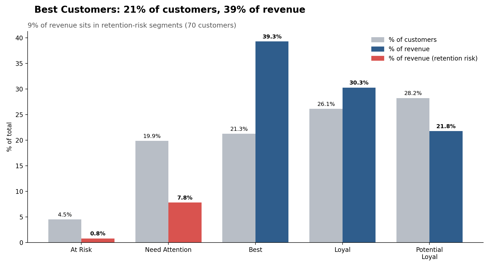

# RFM Customer Segmentation Analysis

Which customers drive revenue, which are at risk, and where should retention effort go first?

## Key findings
- Best Customers are 21% of customers but 39% of revenue
- 70 customers (9% of revenue) sit in retention-risk segments
- 56% of customers generate 80% of revenue

## Tools
MySQL (window functions, temp tables), Python (pandas, matplotlib)

## How to run
1. Import the data into MySQL as `customer_rfm`
2. Run `rfm_customer_analysis.sql`
3. `pip install pandas matplotlib sqlalchemy pymysql`, then `python rfm_visuals.py`
